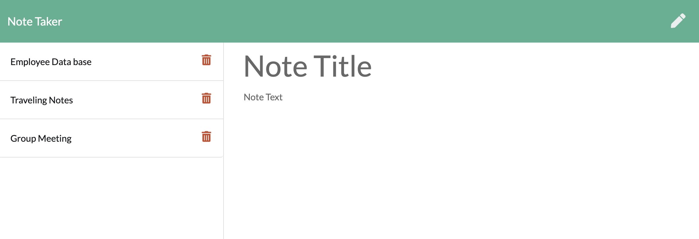

# Note Taker

## Overview

An application that can be used to write, save, and delete notes. 

User can keep track of a lot of information. When you forget or unable to recall something important you will be able to write it down and save it for a later date. Being able to take persistent notes allows users to have written information available when needed.

## Installation

Inquirer Package Manager [pip] (https://www.npmjs.com/package/inquirer/v/0.2.3)

HTTPS:
$ git clone https://britt-hub.github.io/MySQLEmployee-Tracker/

## Built With

Node.js JavaScript runtime
MySql - Data Base

## License
[The Unlicense]
